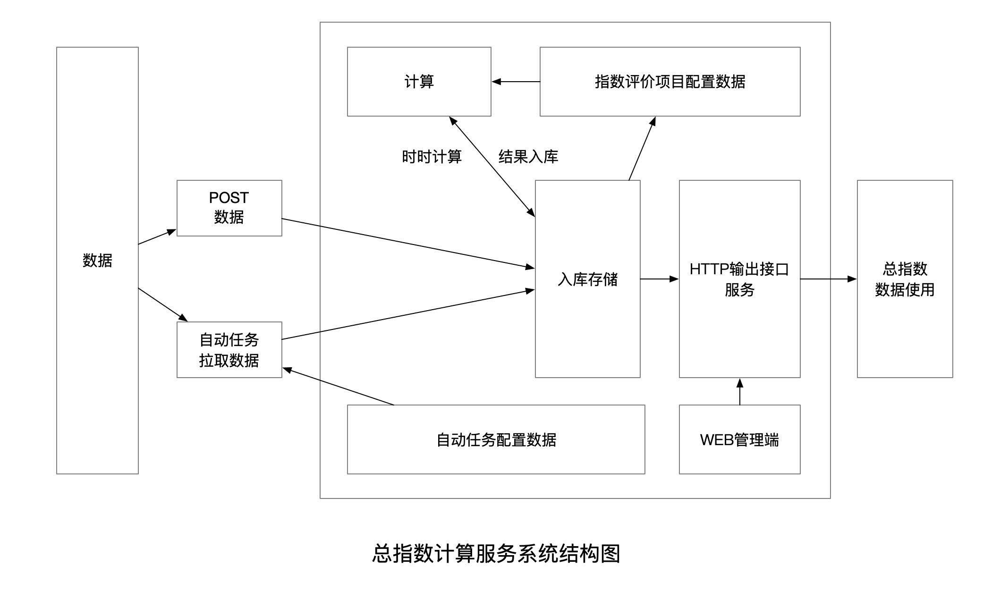
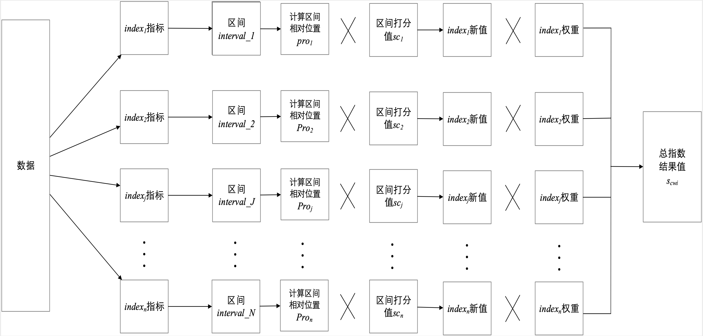

# 指数管理


**KOI(key Operate Index)通用指数计算服务**

指数作为一种对比性的统计指标具有相对数的形式，通常表现为百分数。它表明：若把作为对比基准的水平（基数）视为100，则所要考察的现象水平相当于基数的多少。

　　所谓指数就是指的是n个数值以一定的权值相加后得到的结果，比如a的值是30，占60％的比重，b值是50，占40％比重，那么这个目前的指数就是30x60％+50x40％＝38；
指数的变化与所有指标的变化都有关，也反映整体大势的变化。


* 应用端：为需要总指数的功能提供计算后的结果数据（包括总指数，总指数历史数据，每个指数的指标数据等）
* 管理端：为总指数计算提供配置的管理
* 数据接收：提供了两种为计算服务提供数据的方式（数据源端向本服务进行post推送，或是由本服务程序进行get主动拉取）
* 数据来源设置管理：为本服务程序主动拉取数据进行数据源URI信息的配置管理，数据来源的API要求数据格式为json格式。

[详细接口说明](https://console-docs.apipost.cn/preview/d5203f4fae648aca/33d0ff3cb3dfe83f)

## 系统设计

通用指数计算服务 提供了总指数相关的调用接口、指标相关的配置接口、数据源管理配置接口、数据提交与拉取接口

### 整体逻辑架构图

出于数据获取方式的考虑，我们将数据来源分为*POST*数据（主动推送）和自动任务拉取数据（被动获取）两种方式。

系统在以*POST*方式主动推送数据时，会直接将数据推送到策略计算模块中的数据库暂时存储，然后主动发起实时计算任务，结合指数评价项目配置的数据，完成相应的健康度计算，并将计算结果存储在数据库中。当有*WEB*管理器通过相应的*API*接口请求实时计算结果时，系统会从数据库中获取最新的结算结果返回给对应接口，便于其他模块使用。

当整个系统服务是以自动任务运行时，该模块会通过自动任务配置的相关信息被动从数据管理平台中获取相应数据，然后送入策略计算模块中的数据库，根据配置信息自动执行计算，完成计算后，同样的将计算结果存储在数据库中，并以接口*API*的形式服务于其他模块。

各类指标类数据及自动拉取数据的任务数据需要进行配置，参考接口文档。




### 实时总指数计算方式

这是实时数据计算总指数的计算方式。各指标如果有区间值配置的，先进行区间计算，入值落在区间的偏差率X区间设置的基期值（打分值）X指标权重，之后各个指标结果相加等出的综合指数。区间偏差率，计算入值距离中间值的距离进行计算。通过中间距离的计算，降低了数距误差，提高结果的准确率。

在使用综合加权指数计算健康度时，为了让计算结果更加真实准确，我们采用微积分的思想，将指标所在区间无限分割，那么指标的具体值在区间中的位置和区间分值的乘积更能准确表示指标的真实情况。整个计算流程如下图所示。



当系统在策略计算模块中发起计算任务时，会从数据库中读取每个指标的具体数值**index<sub>j</sub>**，根据 **index<sub>j</sub>** 的值所在对应区间 **interval_J**，用 **interval <sub>minj</sub>** 表示区间 **interval_J** 的左端点，用 **interval<sub>maxj</sub>** 表示区间 **interval_J** 的右端点，那么可以用下面的公式表示指标值 **index<sub>j</sub>** 在区间中的相对位置。公式一：

$$
pro_j=|\frac{index_j-interval_{minj}}{interval_{maxj}-interval_{minj}}|
$$

其中，**pro<sub>j</sub>** 表示指标 **j** 在区间中的相对位置；**index<sub>j</sub>** 表示指标 **j** 的具体数值，**interval<sub>minj</sub>** 表示指标 **j** 所在区间的最小值，**interval<sub>maxj</sub>** 表示指标j所在区间最大值；于是我们有如下综合加权指数的计算公式，公式二：

$$
S_{cwi}=\sum_{j=1}^n pro_j  \times  sc_j \times  wi_j
$$

其中；**s<sub>cwi</sub>** 表示计算的综合加权指数，**n** 表示指标个数， **sc<sub>j</sub>** 表示j所在区间对应的分值，**wi<sub>j</sub>** 表示指标j的权重。

算法一：综合加权指数算法
1 在数据库中查找所有指标的具体数值；
2 分别匹配各个指标数值所在区间；
3 如果指标的值有对应区间，那么
4 根据公式3.1计算指标在区间的相对位置；
5 根据公式3.2计算综合加权指数；
6 返回计算结果；
7 否则
8 没有匹配区间，结果置0；

## 同步数据 

AutopullServer

该服务为AssessServer配套服务，为通用指数计算服务提供自动拉取数据的服务。

注意：数据源的配置在AssessServer管理接口中配置。

该服务为本地化服务程序，直接运行，或是后台运行。

服务器推荐使用*nix服务器系列(包括:Linux, MacOS, *BSD)，以下使用Linux系统为例，使用脚本直接使用。

将应用服务目录复制到目标位置，里面已经写好了执行的脚本，通过脚本来执行。


curl.sh脚本参数：

start|stop|restart|status|tail


> start：启动应用
> stop：停止应用
> restart：重新启动应用
> status：查看应用状态
> tail：查看应用运行的动态输出日志信息

windows系统直接打开使用即可。


## 服务部署

**1、Linux、Mac 类系统部署**

#### 一、独立部署

服务器推荐使用*nix服务器系列(包括:Linux, MacOS, *BSD)，以下使用Linux系统为例，介绍如何部署。

将应用服务目录复制到目标位置，里面已经写好了执行的脚本，通过脚本来执行。


curl.sh脚本参数：

start|stop|restart|status|tail


> start：启动应用
> stop：停止应用
> restart：重新启动应用
> status：查看应用状态
> tail：查看应用运行的动态输出日志信息


#### 二、代理部署

推荐使用Nginx作为反向代理的前端接入层，有两种配置方式实现动静态请求的拆分。

```nginx
server {
    listen       80;
    server_name  www.abc.com;

    access_log   /var/log/gf-app-access.log;
    error_log    /var/log/gf-app-error.log;

    location ~ .*\.(gif|jpg|jpeg|png|js|css|eot|ttf|woff|svg|otf)$ {
        access_log off;
        expires    1d;
        root       /var/www/gf-app/public;
        try_files  $uri @backend;
    }

    location / {
        try_files $uri @backend;
    }

    location @backend {
        proxy_pass                 http://127.0.0.1:8199;
        proxy_redirect             off;
        proxy_set_header           Host             $host;
        proxy_set_header           X-Real-IP        $remote_addr;
        proxy_set_header           X-Forwarded-For  $proxy_add_x_forwarded_for;
    }
}

```

其中，8199为AssessServer应用Web服务监听端口。这个端口在config.toml文件的server下Address参数中配置。

#### 三、supervisor

`supervisor`是用`Python`开发的一套通用的进程管理程序，能将一个普通的命令行进程变为后台`daemon`，并监控进程状态，异常退出时能自动重启。官方网站：http://supervisord.org/ 常见配置如下：

```yaml
[program:AssessServer]
user=root
command=/var/www/AssessServer
stdout_logfile=/var/log/AssessServer-stdout.log
stderr_logfile=/var/log/AssessServer-stderr.log
autostart=true
autorestart=true
```

使用步骤如下：

1. 使用`sudo service supervisor start`启动`supervisor`服务；
2. 创建应用配置文件`/etc/supervisor/conf.d/AssessServer.conf`, 内容如上;
3. 使用`sudo supervisorctl`进入`supervisor`管理终端；
4. 使用`reload`重新读取配置文件并重启当前`supoervisor`管理的所有进程；
5. 也可以使用`update`重新加载配置(默认不重启)，随后使用`start AssessServer启动指定的应用程序；
6. 随后可以使用`status`指令查看当前`supervisor`管理的进程状态；

服务部署启动后，需要有数据接收与输出。

### 获取评估数据值

**1，接收提交的方式：**

数据的接收是通过`/v1/data`接口来进行接的，是一个post类型的接口。其它产生数据的程序，采用post的方式进行提交。

**2，拉取的方式：**

数据的拉取是通过`/v1/remote`接口来进行接的。不需要单独处理，在指数管理页面中可以直接配置，并指定数据值的数据节点路径即可。

### 评估结果应用
**1、获取评价结果数据**

进行数据计算后的最后评估结果值，比如设备健康度、空气指数等。

**2、获取评价结果历史记录**

列出计算后的结果值的历史数据

**3、获取评价项目的详细指标值**

列出这个评估的评价项的指标内容

**4、获取一个评价项目计算指标的历史数据**

列出每个指标数据的历史值
