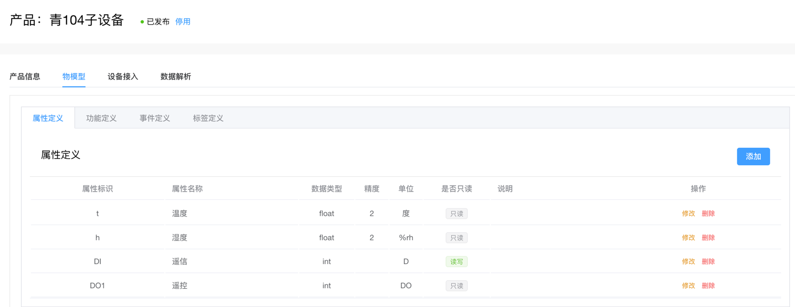
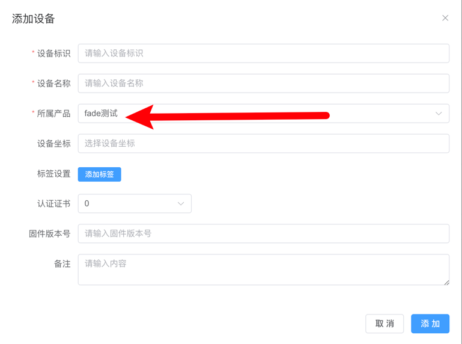
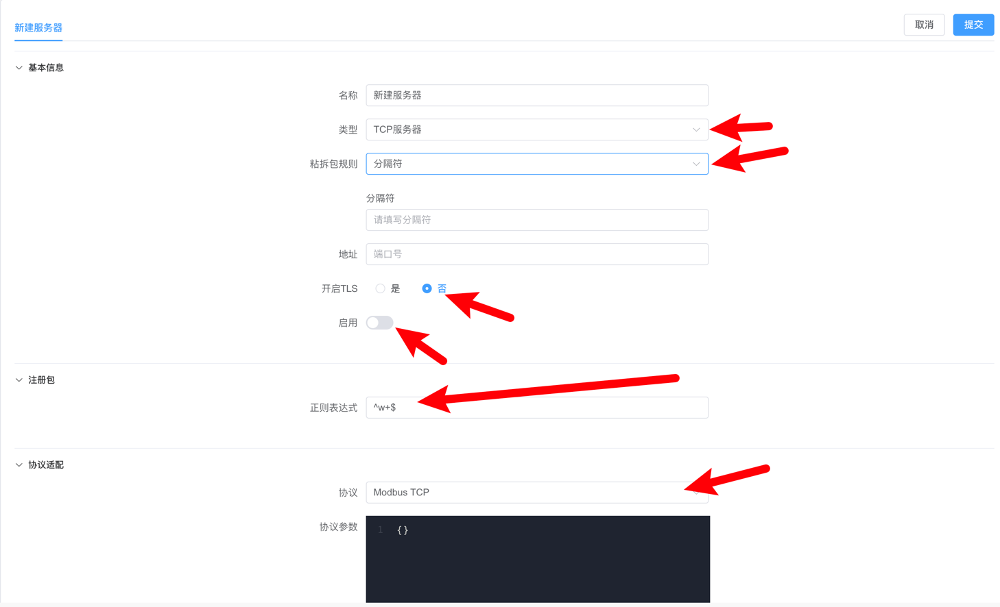

# 1. TCP设备接入

本教程介绍如何使用TCP协议接入sagoo物联网平台。

## 1.1. 安装插件(上传插件)

1. 开发插件，关于插件开发请参阅 [tcp协议插件](../../develop/plugin/tcp-protocol.md)
2. 点击左侧导航栏的`系统配置`->`插件管理`->`上传插件zip`，上传好插件，然后点击 `启用`

## 1.2. 创建tcp产品

登录sagoo物联网平台，点击左侧导航栏的`物联管理`->`设备管理`->`产品`->`添加`，创建一个TCP产品。需要注意的是，消息协议需要选择`Sagoo Mqtt`，传输协议需要选择`TCP服务器`

## 1.3. 创建产品物物模型

登录sagoo物联网平台，点击左侧导航栏的`物联管理`->`设备管理`->`详情`->`物模型` 添加好物模型的相关属性和方法

## 1.4. 创建tcp设备

点击左侧导航栏的`物联管理`->`设备管理`->`产品`->`设备`，创建一个设备。需要注意的是，产品需要选择刚才创建的产品

## 1.5. 创建服务器

点击左侧导航栏的`物联管理`->`网络组件`->`服务器管理`->`新建`，创建一个服务器，或者选择已经存在的服务器。需要注意下面几点

1. `类型`选择`TCP服务器`
2. `分隔符`按照实际请求和接收选择
3. `端口`选择一个自定义端口
4. `开启TLS`暂时选`否`
5. `启用`选择开启
6. `注册包` 按照实际请求来选择，作用是上来tcp连接上来第一个请求包和这个规则做匹配，取出设备key，这个key就是设备的唯一标识，如果匹配不上，tcp连接会被关闭
7. `协议` 按照实际来进行选择，需要和前面产品选择的协议维持一致

## 1.6. 测试设备

1. 上面所有步骤都完成后，就可以测试设备了，打开设备列表，找到自己对应的测试设备(`物联管理`->`设备管理`->`设备`)。

2. 找到对应测试设备后，点击`操作`下面的`详情`按钮，进入设备详情查看设备状态是否在线以及相关属性信息是否上报成功。

