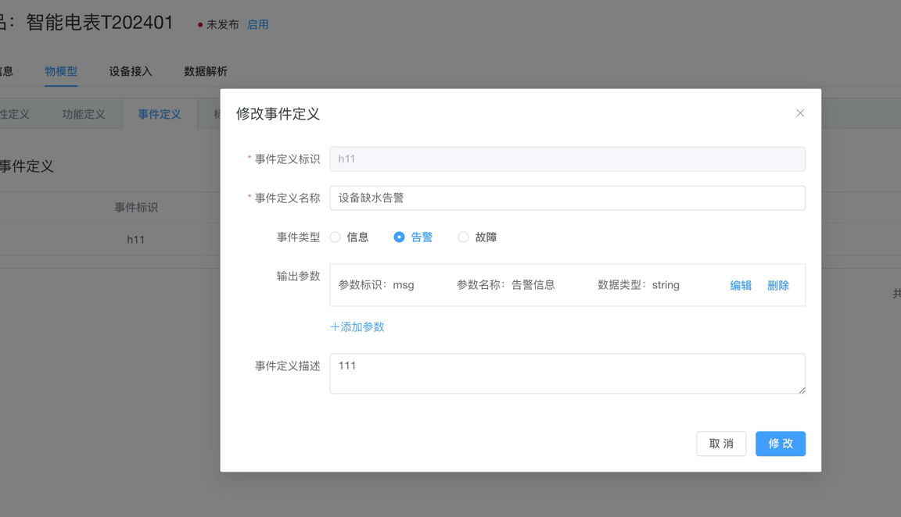

# 产品物模型配置

## 概要说明

物模型是物理空间中的实体在云端的数字化表示，包括传感器设备、消防装置、园区、工厂等。通过定义物模型的属性、功能、事件和标签四个维度，我们能够更全面地描述该实体的特性和能力，以及提供哪些信息给外部系统。此外，还可以自定义补充一些信息，使其更符合业务需求。物模型的这四个维度涵盖了物体的基本属性、行为、状态和元数据等方面，从而完成了产品功能的定义。通过使用物模型，我们可以更加方便地管理和控制实体的运行状态，实现更高效的物联网应用。

| 类型 | 说明                                                         |
| ---- | ------------------------------------------------------------ |
| 属性 | 用于描述设备在运行时所具有的具体信息和状态。例如，环境监测设备可以通过属性来描述当前环境的温度，智能灯可以通过属性来描述开关状态，电风扇可以通过属性来描述风力等级等。属性通常分为三种类型：读、写和上报。其中，读属性用于获取设备当前的属性值，写属性则用于设置设备的属性值，而上报属性则是设备主动向系统上报属性值的类型。 |
| 功能 | 是指设备可供外部调用的指令或方法。功能服务调用可以设置输入和输出参数，其中输入参数用于指定服务执行时所需的参数，而输出参数则表示服务执行后的结果。相比于属性，功能服务可以实现更为复杂的业务逻辑，例如执行某项特定的任务。服务分为两种调用方式：同步和异步。同步调用是指客户端向设备发送服务请求后，等待设备响应后再继续执行后续操作；而异步调用则是指客户端向设备发送服务请求后，立即返回结果并继续执行后续操作，待设备响应后再执行回调函数。通过服务的定义和调用，我们可以更加灵活地操作设备，实现更多样化的物联网应用。 |
| 事件 | 是指设备在运行时主动上报给云端的信息，通常包括需要被外部感知和处理的信息、告警和故障等。事件可以包含多个输出参数，用于描述事件发生时的具体情况。例如，某项任务完成后的通知信息、设备发生故障时的温度和时间信息、设备告警时的运行状态等。事件可以被订阅和推送，当事件发生时，系统可以向订阅者推送相应的消息。通过事件的定义和使用，我们可以更加及时地了解设备的运行状态。 |
| 标签 | 是指设备跟据业务需要自定义标签信息。                         |

## 支持的数据类型

| 参数      | 说明                                                         | 示例                        |
|---------| ------------------------------------------------------------ |---------------------------|
| int     | 32位整形                                                     | 100                       |
| float   | 单精度浮点型                                                 | 10.4                      |
| double  | 双精度浮点型                                                 | 10.45                     |
| text    | 字符串，对应的数据长度不能超过10240字节。                    | 你好，SagooIOT               |
| date    | 时间戳。默认格式为String类型的UTC时间戳，单位：毫秒。        | 1626738482010             |
| boolean | 布尔型。采用0（false）或1（true）来定义布尔值                | 1表示是、0表示否                 |
| enum    | 枚举型。定义枚举项的参数值和参数描述。                       | `[{key:1,value:1}]`         |
| array   | 数组。需声明数组内的元素类型、数组元素个数。需确保同一个数组元素类型相同。元素个数限制为1~512个。 | [1, 2, 3, 4, 5, 6]        |
| Object  | 结构体数据，支持树形结构化数据。树形数据格式为JSON。 | `[{"name":"开关","value":1}]` |

## 属性定义
物模型的属性，是设备的状态信息，可以是设备的运行状态，也可以是设备的配置信息，也可以是设备的统计信息。属性的值可以是数值、字符串、枚举、布尔值等。

**是否只读：** 属性是否只读，只读属性只能由设备上报，不能由云端下发。如果是读写属性，可以由设备上报，也可以由云端下发。

## 功能定义

物模型的功能（服务）定义，是设备的功能，可以是设备的控制功能，也可以是设备的配置功能，也可以是设备的统计功能。功能的参数可以是数值、字符串、枚举、布尔值等。

对于每个设备端的功能，都需要在云端定义一个功能，以便于云端调用。跟据设备端的功能定义，云端定义功能的参数，以及功能的返回值。

## 事件定义
物模型的事件定义，是设备的事件，可以是设备的告警事件，也可以是设备的统计事件。事件的参数可以是数值、字符串、枚举、布尔值等。
对于每个设备端的事件，都需要在云端定义一个事件，以便于云端调用。跟据设备端的事件定义，云端定义事件的参数。

## 标签定义
物模型的标签定义，是设备的标签，可以是设备的位置信息，也可以是设备的统计信息。标签的值可以是数值、字符串、枚举、布尔值等。

## 物模型导入/导出

进入到物联网平台的产品详情页面，点击物模型，可以看到物模型的定义页面，点击右上角的导入/导出按钮，可以导入/导出物模型的定义。
