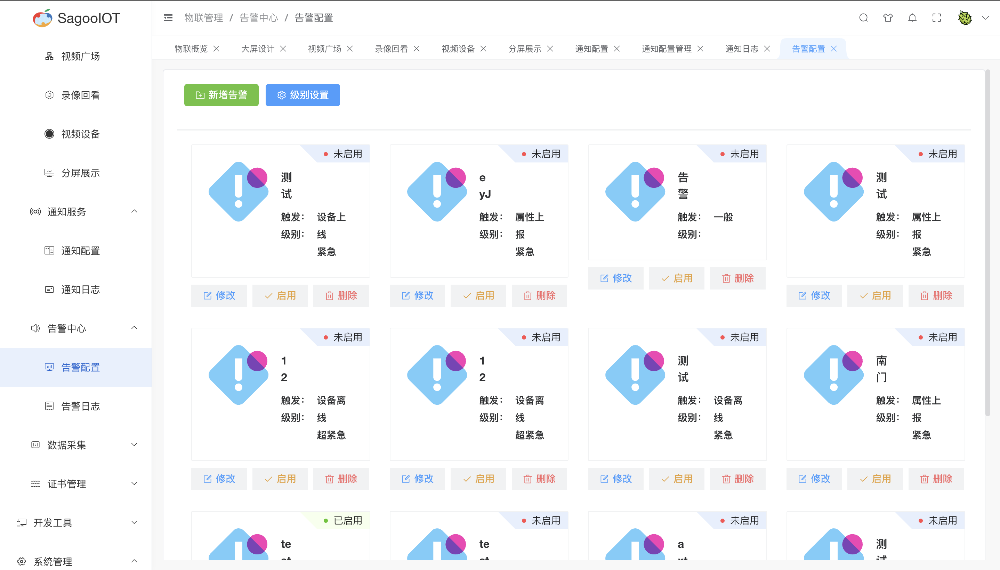
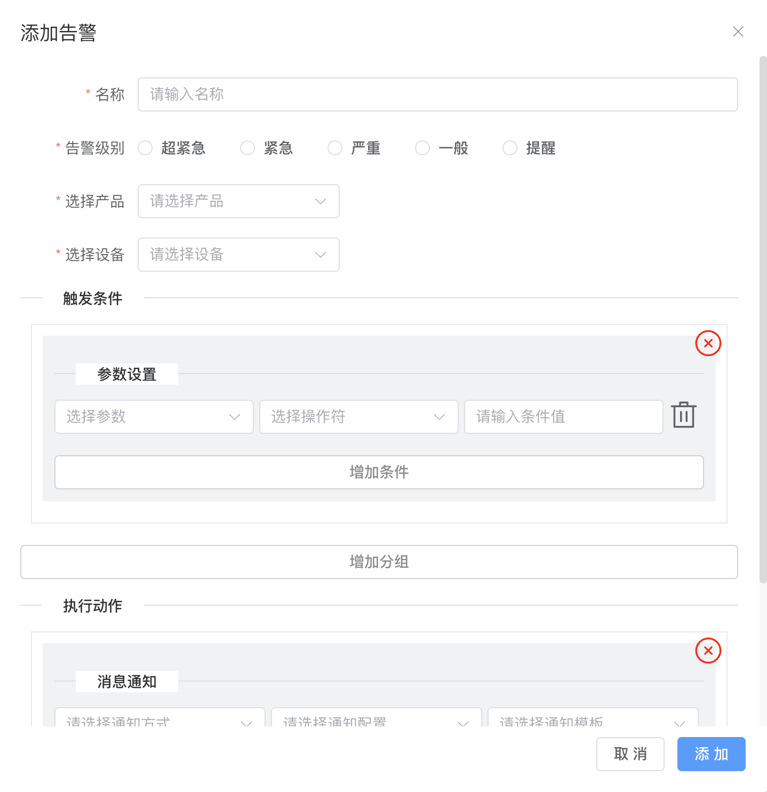

# 告警配置

通过这里管理系统内的所有的告警规则，通过触发告警规则时可产生对应的告警记录数据。

## 级别设置
- 告警级别用于描述告警的严重程度，根据业务管理方式进行自定义
- 告警级别将会在告警配置中被引用
- 最多可配置5个级别，以下为默认级别描述
    1. 超紧急
    2. 紧急
    3. 严重
    4. 一般
    5. 提醒

## 告警规则配置
告警配置中提供新增告警、告警数据列表展示。

- 新增告警，提供了告警基础信息、触发条件、执行动作进行信息维护。
- 级别设置，可对告警级别信息进行维护。

物联管理->告警中心->告警配置

## 新增告警

- 告警规则一般包含：告警名称、告警级别、触发条件、执行动作
- 根据指定产品下的具体设备来触发规则，触发方式包含：设备上线、设备离线、属性上报
- 触发条件采用分组设置，每组之间的触发关系可选择：并且(and)、或(or)，同时每组参数条件可设置多项
    - 参数条件目前支持，数据上报的时间、物模型属性
    - 支持的操作符有，等于、不等于、大于、大于等于、小于、小于等于、在...之间、不在...之间
    - 参数条件值目前支持自定义输入，如：参数选择上报时间，操作符选择小于，条件就可以输入'2022-12-12'
- 支持动作采用分组设置，每组按顺序执行，目前仅支持消息通知
    - 通知方式包含：短信、邮件、微信、钉钉、语音、webhook
    - 支持选择通知方式下的通知配置和通知模板
    - 支持多个接收人

## 告警日志
告警日志中支持按告警时间对数据进行筛选，并且支持查看告警日志以及处理记录。

