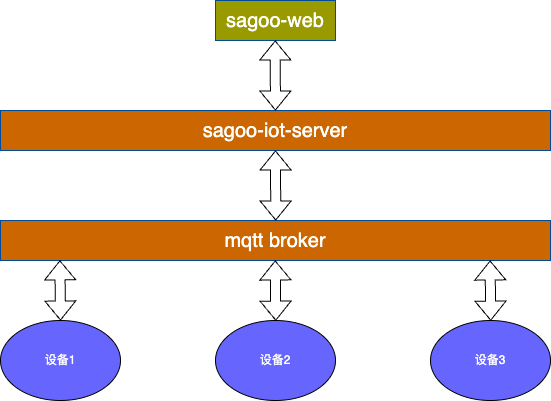
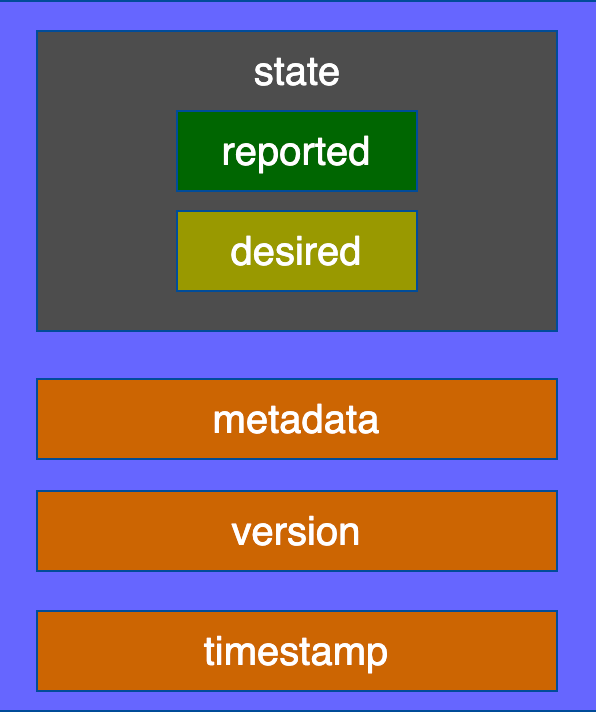

- [1. 概念](#1-概念)
- [2. 应用场景](#2-应用场景)
  - [2.1. 场景1：设备经常断线连接，导致应用程序无法正确请求设备状态。](#21-场景1设备经常断线连接导致应用程序无法正确请求设备状态)
  - [2.2. 场景2：多个程序同时请求获取设备状态。](#22-场景2多个程序同时请求获取设备状态)
  - [2.3. 场景3：设备掉线问题。](#23-场景3设备掉线问题)
  - [2.4. 场景4：设备状态比对通知](#24-场景4设备状态比对通知)
  - [2.5. 场景5：设备初始配置信息获取](#25-场景5设备初始配置信息获取)
- [3. 整体组件结构](#3-整体组件结构)
- [4. 影子json文档组成部分](#4-影子json文档组成部分)
- [5. 使用场景](#5-使用场景)
  - [5.1. 设备主动上报状态](#51-设备主动上报状态)
  - [5.2. 设备主动获取影子内容](#52-设备主动获取影子内容)
  - [5.3. 设备主动删除影子内容](#53-设备主动删除影子内容)
- [6. 平台使用流程(todo)](#6-平台使用流程todo)

# 1. 概念

设备影子（Device Shadow）是设备在云端的虚拟映射（可以理解为一个json文档）。它充当了设备状态的虚拟表示或“影子”，并能在设备离线或断网时保存设备的最后已知状态。设备影子通常存储在云端，可以通过API进行访问和操作。设备影子的概念让我们能够在设备不在线的情况下仍然改变它的期望状态。当设备恢复在线时，它可以查看影子，看到期望状态已经改变，并据此调整自己的状态。这使得远程和异步控制成为可能，是IoT系统中的重要工具。


# 2. 应用场景

## 2.1. 场景1：设备经常断线连接，导致应用程序无法正确请求设备状态。

设备网络不稳定，导致频繁的设备上下线。当应用程序需要获取当前设备状态时，恰好设备掉线，导致请求失败；但下一秒设备又重新连接成功，此时应用程序无法立即重新发起请求。

利用设备影子机制，存储设备的最新状态。每当设备状态发生变化时，设备会将这个变化同步到设备影子中。应用程序只需请求或订阅推送方式获取影子中的状态即可，无需考虑设备的在线状态。

## 2.2. 场景2：多个程序同时请求获取设备状态。

在设备网络稳定的情况下，多个应用程序同时请求获取设备状态，这会导致设备需要响应多次相同的请求，但设备本身的处理能力有限，难以承受这种重复请求的压力。

利用设备影子机制，设备只需要主动一次性将状态同步给设备影子。多个应用程序可以请求或订阅推送方式获取设备影子中存储的设备状态，从而获得设备的最新状态，实现应用程序和设备之间的解耦。

## 2.3. 场景3：设备掉线问题。

设备的网络不稳定，导致设备频繁断线。当应用程序发送控制指令给设备时，设备处于离线状态，导致指令无法传递给设备。虽然可以使用QoS=1或2来解决此问题，但这会给服务端带来较大压力，通常不推荐使用。

利用设备影子机制，应用程序发送控制指令时，指令带有时间戳，并保存在设备影子中。当设备重连时，它会获取指令并根据时间戳确定是否执行。

设备连接掉线时，指令发送失败。然后设备在重新上线时，设备影子功能会根据指令的时间戳，确保设备不会执行过期的指令。

## 2.4. 场景4：设备状态比对通知

设备在上报状态时，仅报告发生变化的部分。此时，应用程序对于变化的属性值更感兴趣。反之，设备对应用程序也是如此。

应用程序或设备更新属性（desired/reported）后，设备或应用程序可以获得差异推送（delta），从而只关注实际发生变化的数据部分。

## 2.5. 场景5：设备初始配置信息获取
设备在首次连接时需要一些配置项或参数作为初始化配置。通常情况下，这些配置信息可以写入固件，但针对不同设备的特定配置可能难以处理。

利用设备影子机制，可以将通用的配置写入影子模板中。当使用此模板创建设备时，模板的内容将作为设备初始版本的影子。如果需要针对特定设备进行初始配置变更，也可以有针对性地更新其影子，设备在首次连接时通过获取影子即可获得所需的期望配置。

# 3. 整体组件结构




# 4. 影子json文档组成部分



1. **state**
    - **reported**: 存储设备上报的状态。设备通过“设备更新影子”协议向文档部分写入数据，以报告其新状态。
    - **desired**: 存储配置设备的数据。通过sagoo-web更新配置数据，设备可通过“设备获取影子”协议主动获取影子数据到设备。
2. **metadata**
   - 设备影子的元数据信息，包括state部分每个属性项的最后更新时间等。
3. **version**
   - 设备影子文档的版本号，每次设备影子文档更新之后，版本号都会递增。
4. **timestamp**
   - 设备影子文档的最后一次更新时间。

```json
{
    "state": {
        "desired": {
            "color": "RED", 
            "sequence": [
                "RED", 
                "GREEN", 
                "BLUE"
            ]
        }, 
        "reported": {
            "color": "GREEN"
        }
    }, 
    "metadata": {
        "desired": {
            "color": {
                "timestamp": 1469564492
            }, 
            "sequence": {
                "timestamp": 1469564492
            }
        }, 
        "reported": {
            "color": {
                "timestamp": 1469564492
            }
        }
    }, 
    "timestamp": 1469564492, 
    "version": 1
}
```


# 5. 使用场景

## 5.1. 设备主动上报状态


1. topic  `/shadow/a1PbRCF****/lightbulb/update`
2. 发送的JSON消息格式
   ```json
   {
        "method": "update", 
        "state": {
            "reported": {
                "color": "red"
            }
        }, 
        "version": 1
    }
   ```
3. 文档更新
   ```json
    {
        "state": {
            "reported": {
                "color": "red"
            }
        }, 
        "metadata": {
            "reported": {
                "color": {
                    "timestamp": 1469564492
                }
            }
        }, 
        "timestamp": 1469564492, 
        "version": 1
    }
    ```
4. 响应消息
   1. 成功
        ```json
            {
                "method": "reply", 
                "payload": {
                    "status": "success", 
                    "version": 1
                }, 
                "timestamp": 1469564576
            }
        ```
        
   2. 失败
        ```json
            {
                "method": "reply", 
                "payload": {
                    "status": "error", 
                    "content": {
                        "errorcode": "${errorcode}", 
                        "errormessage": "${errormessage}"
                    }
                }, 
                "timestamp": 1469564576
            }
        ```

## 应用程序改变设备状态


1. sagoo-iot平台下发消息更改灯泡状态，例如需将灯泡的color属性值改为gree
2. 设备影子接收到更新请求，更新其影子文档为
     ```json
    {
        "state": {
            "reported": {
                "color": "red"
            }, 
            "desired": {
                "color": "green"
            }
        }, 
        "metadata": {
            "reported": {
                "color": {
                    "timestamp": 1469564492
                }
            }, 
            "desired": {
                "color": {
                    "timestamp": 1469564576
                }
            }
        }, 
        "timestamp": 1469564576, 
        "version": 2
    }
    ```
3. 设备影子更新完成后，发送返回结果到Topic `/shadow/a1PbRCF****/lightbulb/get` 中。返回结果信息构成由设备影子决定
   ```json
    {
        "method": "control", 
        "payload": {
            "state": {
                "reported": {
                    "color": "red"
                }, 
                "desired": {
                    "color": "green"
                }
            }, 
            "metadata": {
                "reported": {
                    "color": {
                        "timestamp": 1469564492
                    }
                }, 
                "desired": {
                    "color": {
                        "timestamp": 1469564576
                    }
                }
            }
        }, 
        "version": 2, 
        "timestamp": 1469564576
    }
   ```
4. 如果设备灯泡在线，并且订阅了Topic `/shadow/a1PbRCF****/lightbulb/get` ，则会立即收到消息,收到消息后，根据请求文档中desired的值，将灯泡颜色变成绿色。灯泡更新完状态后，上报最新状态到物联网平台。
   ```json
    {
        "method": "update", 
        "state": {
            "reported": {
                "color": "green"
            }
        }, 
        "version": 3
    }
   ```
5. 设备影子会返回响应结果给设备，发送消息到设备订阅的Topic `/shadow/a1PbRCF****/lightbulb/get` 中
6. 最新状态上报成功后， 设备端和设备影子进行以下操作
   1. 设备端发消息到Topic `/shadow/a1PbRCF****/lightbulb/update` 中清空desired属性
        ```json
            {
                "method": "update", 
                "state": {
                    "desired": "null"
                }, 
                "version": 4
            }
        ```
   2. 设备影子会同步更新影子文档
        ```json
           {
                "state": {
                    "reported": {
                        "color": "green"
                    }
                }, 
                "metadata": {
                    "reported": {
                        "color": {
                            "timestamp": 1469564577
                        }
                    }, 
                    "desired": {
                        "timestamp": 1469564576
                    }
                }, 
                "version": 4
            }
        ```

## 5.2. 设备主动获取影子内容


1. 灯泡主动发送以下消息到Topic `/shadow/a1PbRCF****/lightbulb/update` 中，请求获取设备影子中保存的最新状态。
    ```json
        {
            "method": "get"
        }
    ```
2. 当设备影子收到这条消息后，发送最新状态到Topic `/shadow/a1PbRCF****/lightbulb/get` 灯泡通过订阅该Topic获取最新状态
   ```json
        {
            "method": "reply", 
            "payload": {
                "status": "success", 
                "state": {
                    "reported": {
                        "color": "red"
                    }, 
                    "desired": {
                        "color": "green"
                    }
                }, 
                "metadata": {
                    "reported": {
                        "color": {
                            "timestamp": 1469564492
                        }
                    }, 
                    "desired": {
                        "color": {
                            "timestamp": 1469564492
                        }
                    }
                }
            }, 
            "version": 2, 
            "timestamp": 1469564576
        }
   ```

## 5.3. 设备主动删除影子内容


1. 灯泡主动发送以下消息到Topic `/shadow/a1PbRCF****/lightbulb/update` 中，请求获取设备影子中保存的最新状态。
    ```json
        {
            "method": "get"
        }
    ```
2. 当设备影子收到这条消息后，发送最新状态到Topic `/shadow/a1PbRCF****/lightbulb/get` 灯泡通过订阅该Topic获取最新状态
   ```json
        {
            "method": "reply", 
            "payload": {
                "status": "success", 
                "state": {
                    "reported": {
                        "color": "red"
                    }, 
                    "desired": {
                        "color": "green"
                    }
                }, 
                "metadata": {
                    "reported": {
                        "color": {
                            "timestamp": 1469564492
                        }
                    }, 
                    "desired": {
                        "color": {
                            "timestamp": 1469564492
                        }
                    }
                }
            }, 
            "version": 2, 
            "timestamp": 1469564576
        }
   ```

# 6. 平台使用流程(todo)

