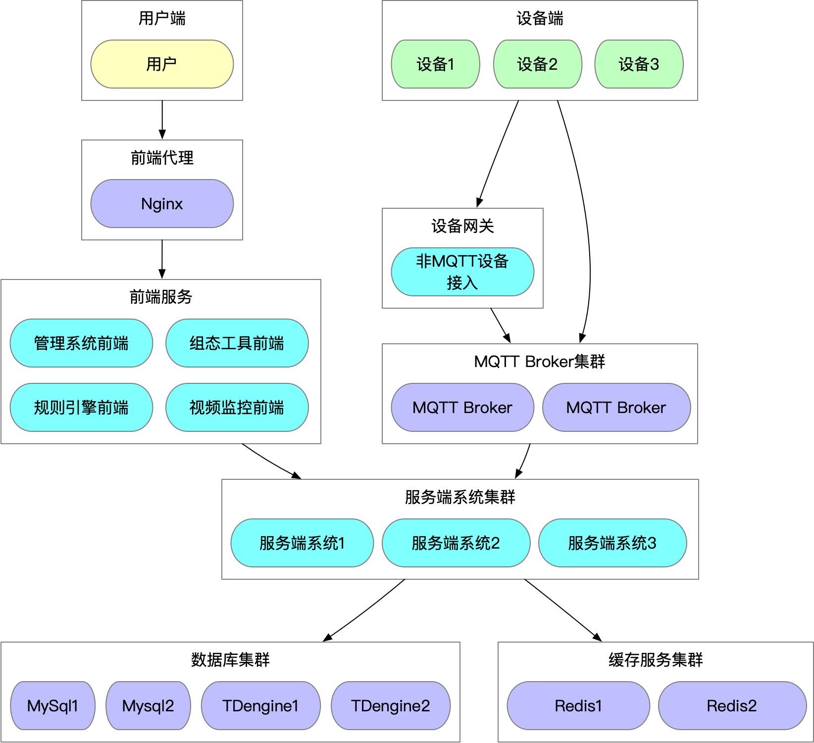
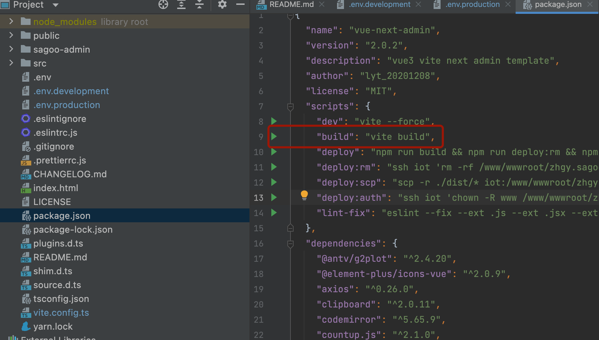
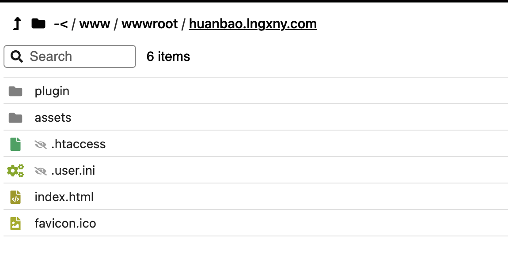

# 安装系统


该程序可以独立部署，直接执行使用，也可以与nginx或是apache联合使用。


## 硬件要求

**最低配置**

|CPU|1核心|
|--|--|
|内存|1GB|
|硬盘|40G|

**推荐配置**

|CPU|2核+|
|--|--|
|内存|4GB+|
|硬盘|40GB+|


## 环境安装

Mysql5.6以上

Redis6.x

TDengine 3.0【[安装文档](https://docs.taosdata.com/get-started/package/)】

## 独立部署

服务器推荐使用lnix服务器系列(包括:Linux, MacOS, *BSD)，以下使用Linux系统为例，介绍如何部署。
将应用服务目录复制到目标位置，里面写好了执行的脚本，通过脚本来执行。


```
curl.sh脚本参数：

start|stop|restart|status|tail

```


## 代理部署

推荐使用Nginx作为反向代理的前端接入层，有两种配置方式实现动静态请求的拆分。

```
server {
    listen       80;
    server_name  www.abc.org;

    access_log   /var/log/gf-app-access.log;
    error_log    /var/log/gf-app-error.log;

    location ~ .*\.(gif|jpg|jpeg|png|js|css|eot|ttf|woff|svg|otf)$ {
        access_log off;
        expires    1d;
        root       /var/www/gf-app/public;
        try_files  $uri @backend;
    }

    location / {
        try_files $uri @backend;
    }

    location @backend {
        proxy_pass                 http://127.0.0.1:8200;
        proxy_redirect             off;
        proxy_set_header           Host             $host;
        proxy_set_header           X-Real-IP        $remote_addr;
        proxy_set_header           X-Forwarded-For  $proxy_add_x_forwarded_for;
    }
}

```

其中，8200为本地编译的应用Web服务监听端口。这个端口在config.toml文件的Address参数中配置。


## 集群部署

**系统部署图**




## 详细安装过程

### 基础服务

1. Redis 7.0.4
2. TDengine 3.0.1.5
3. EMQX 5.0.9-el8
4. Nginx 1.22.0
5. rule-engine

部署步骤

#### 1. 安装redis

1. 安装目录: `/www/service/redis`

2. 修改配置文件

   

    3. 启动redis

       使用宝塔进行启动或者进入到src目录下使用./redis-server进行启动

#### 2. 安装TDengine

1. 官网地址:` https://www.taosdata.com/`

2. 下载安装包到服务器`/opt/TDengine`目录下

   

3. 使用tar -zxf解压压缩包

4. 进入到TDengine-server-3.0.1.5目录里使用命令`sudo ./install.sh`进行安装

5. 使用`systemctl start taos`启动

6. 使用`systemctl status taosd`查看TD是否启动成功

   

7. 使用命令taos进入命令窗口

8. 使用`alter user root pass '密码';`对root用户设置权限，也可使用create user创建用户

9. 系统使用http形式连接，故需`systemctl start taosadapter`启动taosadapter

#### 3. 安装EMQX

1. 官网地址:` https://www.emqx.com/zh`

2. `wget https://www.emqx.com/zh/downloads/broker/5.0.9/emqx-5.0.9-el8-amd64.tar.gz `下载对应版本的emqx到/opt目录下

3. 在/opt/目录下通过`mkdir -p emqx && tar -zxvf emqx-5.0.9-el8-amd64.tar.gz -C emqx`解压

4. 使用`./emqx/bin/emqx start `命令进行启动

5. `http://localhost:18083/ `登录此地址查询是否安装成功，默认账号: admin 密码: public

6. 设置权限认证

   

#### 4.  安装Nginx

1. 安装目录` /www/server/nginx`(通过宝塔进行安装)
2. 使用宝塔启动方式进行启动

1. 部署应用服务

    1. 更改config.yaml配置

       

       

    2. 使用`./build.sh linux`进行打包

    3. 将编译后的文件上传至服务器

       目录为: `/home/sagoo-admin`

    4. 进入到sagoo-admin目录下，使用`./curl.sh start`启动

#### 5.  rule-engine

**服务器(cent os)安装nodejs 最新版**

1. `yum list nodejs` 查看是否为最新版本
2. 如果不是，通过下面代码增加源信息 `curl --silent --location https://rpm.nodesource.com/setup_18.x | sudo bash`
3. 然后在 `yun install nodejs`

**如果安装包过慢，可以先设置淘宝源  `npm config set registry https://registry.npm.taobao.org/`**

1. 全局安装 pm2 `sudo npm i pm2 -g`
2. 将【rule-engine】项目拷贝到服务器上
3. 在【rule-engine】目录下安装包依赖 `npm install`
4. 启动项目 `pm2 start packages/node_modules/node-red/red.js --name rule-engine:1880`  之后可以通过 `pm2 show rule-engine:1880` 查看项目运行情况
5. 按照【rule-engine】项目下 `nginx/node-red.conf` 文件的配置增加一下nginx配置，来保证规则引擎和iot的同源

#### 6. 前端部署

1. 点击build打包构建

   

2. 将打包后的文件上传至服务器`/www/wwwroot/huanbao.lngxny.com`目录下即可

   

